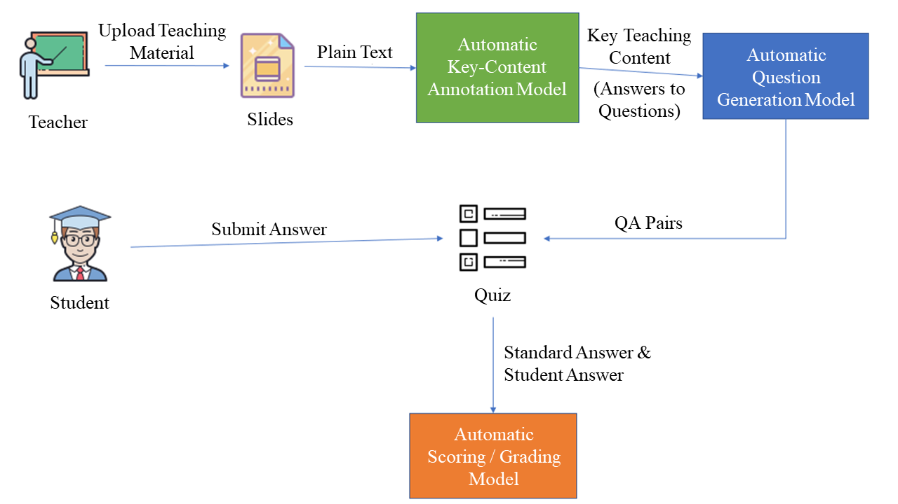

# Intelligent Teaching – NLP for Key-Content Annotation and Automatic Question Generation and Scoring

This project represents my independent study (special project) at NCU CSIE. It implements an **AI-assisted teaching and learning system** using Natural Language Processing (NLP) and Transfer Learning.

The system automatically:

* 📌 Extracts and annotates key concepts from teaching materials
* ❓ Generates corresponding questions from important content
* 🎯 Evaluates question difficulty using fine-tuned BERT
* 📝 Automatically grades student answers using semantic similarity

The goal is to **assist teachers in exam/assignment creation** and **help students focus on core concepts efficiently** in distance learning environments.

---

## 🚀 System Overview

---

## 🔍 Core Techniques & Methodology

### 1. Keyphrase Extraction (Highlighting Important Concepts)

The system identifies the most important concepts from educational content (such as slides or textbooks) to help students focus on essential learning points.

| Method | Type | Core Principle |
| --- | --- | --- |
| **PKE** | Supervised / Unsupervised | A flexible toolkit that ranks candidates based on statistical weights or pre-trained features. |
| **TextRank** | Unsupervised | A graph-based algorithm where word nodes are ranked using PageRank-style connectivity. |
| **KeyBERT** | Supervised | Leverages BERT embeddings and cosine similarity to find phrases that best represent the document semantics. |
| **BERT Keyword Extractor** | Supervised | A BERT-based classifier fine-tuned on the SemEval-2010 dataset for phrase identification. |

* **Final Choice: PKE (Python-based Keyphrase Extraction)**  
We selected PKE as the core engine because it supports both supervised and unsupervised models (trained on the SemEval-2010 dataset) to rank and select the top $N$ key phrases, allowing users to explicitly specify the number of extracted keywords.

### 2. Question Generation (T5-based)

After extracting key phrases and sentences, we generate corresponding questions using a unified text-to-text framework.

* **T5 (Text-to-Text Transfer Transformer)**: T5 treats all NLP tasks as **Text-to-Text** with the use of a unified framework. This allows the system to apply the same model, loss function, training procedure, and decoding process to complete diverse NLP tasks seamlessly. We utilize a `t5-base` architecture to convert input text into QA pairs.

* **Custom Fine-tuning**: We fine-tuned the `t5-base-question-generator` model (originally pre-trained on SQuAD, RACE, and CoQA) using the "Python Questions from Stack Overflow" Kaggle dataset to better handle technical and programming-related educational content.

* **Question Variety**: The system is capable of generating mixed types of questions, including open-ended short-answer questions and multiple-choice questions (MCQs), where answers are extracted directly from the source text.

### 3. Answer Scoring & Question Difficulty Evaluation

The system closes the teaching loop by automatically scoring student answers and estimating the difficulty of generated questions to maintain exam quality.

* **Semantic Answer Scoring:** Student responses are evaluated against standard answers using a weighted average of four metrics:

    | Metric | Category | Description |
    | --- | --- | --- |
    | **Sentence-BERT** | Semantic | Uses BERT networks to map sentences to a semantic space for cosine similarity. |
    | **BLEU** | N-gram Precision | Measures the overlap of words between the student and standard answer. |
    | **ROUGE-N** | N-gram Recall | Focuses on how much of the standard answer was captured by the student. |
    | **ROUGE-L** | Structural | Evaluates similarity based on the Longest Common Subsequence (LCS). |

* **Question Difficulty Classification**: To ensure exams are balanced, we use a `BERTForSequenceClassification` model. It categorizes questions into three difficulty levels based on **Orientation, Relation, and Complexity**.

---

## 📊 Experimental Results

* **Keyphrase Extraction**: Achieved an average **F1-score of 80%** using the PKE framework.

* **Question Quality**: T5-generated questions reached an average similarity score of **83%** compared to human-authored questions in the SQuAD v1.0 dataset.

* **Answer Scoring**: The integration of Sentence-BERT enables high-precision semantic matching, allowing the system to understand responses rather than just matching keywords.

* **Difficulty Prediction**: While achieving 0.69 accuracy, analysis suggests performance can be further optimized by addressing dataset scale and label distribution.

---

## 🔭 Future Work

* Integration with online teaching platforms for real-time note-taking.

* Combining the system with web crawling for extended extracurricular learning.

* Implementing multi-lingual support to benefit a global audience of students and teachers.

---

## 📄 Report

For a detailed look at our methodology and full analysis, please see the complete report: [View PDF](./docs/Intelligent_Teaching.pdf)
